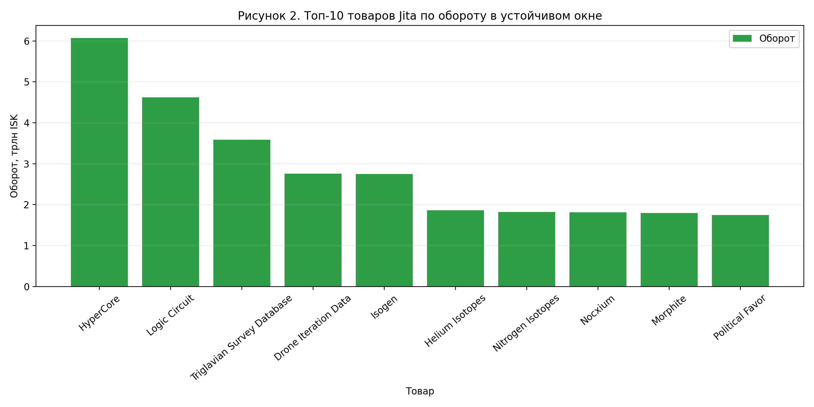
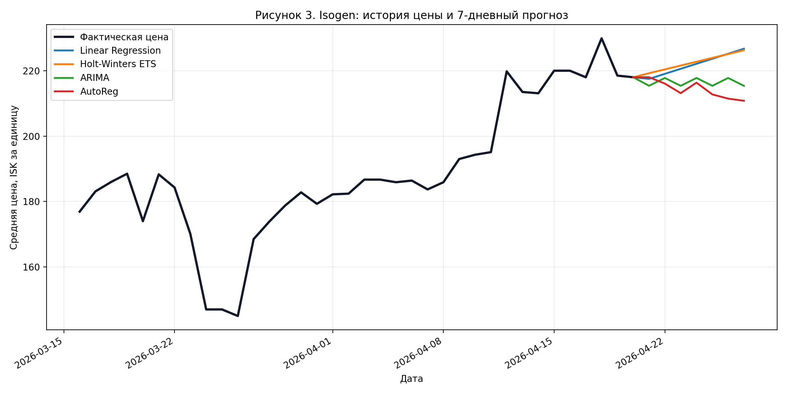
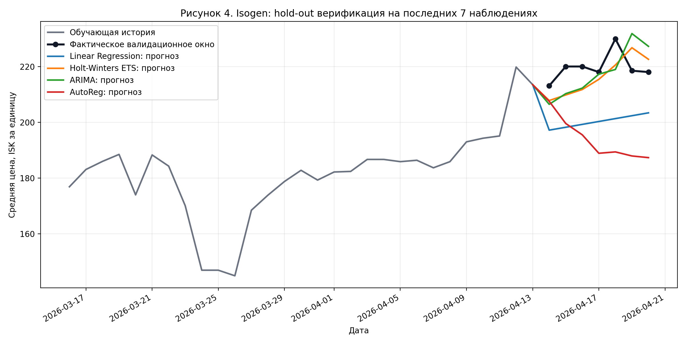

# Результаты вычислительного эксперимента (Трек П)

## План эксперимента и расчётов

Эксперимент выполнен на реальных данных проекта FluxEV Engine, сохранённых в таблице `market_history` PostgreSQL. На момент расчёта в базе содержалось `125034` строк рыночной истории, из которых `123107` строк попали в устойчивое экспериментальное окно. В расчётах использовано стабильное окно наблюдений `2026-03-16`-`2026-04-20` (36 календарных дней). День `2026-04-21` исключён из основного эксперимента, так как в БД на момент расчёта он был заполнен лишь частично.

В качестве основной площадки для сравнения методов прогноза выбран хаб `Jita`, поскольку он обладает максимальной ликвидностью и наибольшим числом наблюдений. Для детального сравнения были взяты пять базовых ресурсов с полной ежедневной историей в выбранном окне: `Tritanium`, `Pyerite`, `Mexallon`, `Isogen`, `Nocxium`. Для каждого сценария использовались одинаковые параметры: горизонт прогноза `7` дней, валидационное окно `7` последних наблюдений, а также единый набор моделей `linear`, `holt_winters`, `arima`, `autoreg`. Такой дизайн исключает влияние различий во входных данных и позволяет интерпретировать разницу результатов именно как следствие различий между алгоритмами.

**Таблица 1. План вычислительного эксперимента**

| Сценарий | Регион | Товар | Период | Наблюдений | Горизонт_прогноза | Окно_валидации | Методы | Мин_цена_ISK | Макс_цена_ISK |
| --- | --- | --- | --- | --- | --- | --- | --- | --- | --- |
| S1 | Jita | Tritanium | 2026-03-16..2026-04-20 | 36 | 7 | 7 | linear, holt_winters, arima, autoreg | 3.86 | 4.22 |
| S2 | Jita | Pyerite | 2026-03-16..2026-04-20 | 36 | 7 | 7 | linear, holt_winters, arima, autoreg | 16.41 | 19.1 |
| S3 | Jita | Mexallon | 2026-03-16..2026-04-20 | 36 | 7 | 7 | linear, holt_winters, arima, autoreg | 55.2 | 68.49 |
| S4 | Jita | Isogen | 2026-03-16..2026-04-20 | 36 | 7 | 7 | linear, holt_winters, arima, autoreg | 145.0 | 229.9 |
| S5 | Jita | Nocxium | 2026-03-16..2026-04-20 | 36 | 7 | 7 | linear, holt_winters, arima, autoreg | 776.1 | 944.4 |

## Таблицы с численными данными

Сначала были рассчитаны агрегированные показатели оборота по ключевым торговым регионам в том же устойчивом окне. Полученные значения показывают ярко выраженную концентрацию рыночной активности в `Jita`: суммарный оборот этого хаба составил 106 667 502 025 945.67 ISK, что соответствует 84.21% всего оборота рассматриваемой выборки.

**Таблица 2. Оборот по регионам в окне `2026-03-16`-`2026-04-20`**

| Регион | Строк | Оборот_ISK | Оборот_трлн_ISK | Доля_проц |
| --- | --- | --- | --- | --- |
| Jita | 34586 | 106 667 502 025 945.67 | 106.668 | 84.21 |
| Amarr | 26925 | 9 765 541 582 516.62 | 9.766 | 7.71 |
| Dodixie | 24446 | 7 152 319 672 029.24 | 7.152 | 5.65 |
| Hek | 19433 | 2 117 029 183 630.44 | 2.117 | 1.67 |
| Rens | 17717 | 965 881 634 082.59 | 0.966 | 0.76 |

Основная таблица сравнения моделей строилась по валидационным метрикам. Критерием выбора лучшего метода в каждом сценарии служил минимум `Validation_MAE`, так как именно эта метрика используется в проекте для выбора предпочтительной модели на одном временном ряду.

**Таблица 3. Сравнение моделей по товарам (Jita, валидационное окно 7 дней)**

| Товар | Метод | Validation_MAE | Validation_RMSE | Validation_MAPE_проц | R2 | Лучший_для_товара |
| --- | --- | --- | --- | --- | --- | --- |
| Tritanium | Linear Regression | 0.045729 | 0.050433 | 1.103148 | 0.739098 | yes |
| Tritanium | Holt-Winters ETS | 0.105214 | 0.119559 | 2.546277 | 0.809093 | no |
| Tritanium | ARIMA | 0.053086 | 0.074924 | 1.293522 | 0.764278 | no |
| Tritanium | AutoReg | 0.126186 | 0.137389 | 3.047109 | 0.831631 | no |
| Pyerite | Linear Regression | 0.260157 | 0.279972 | 1.391693 | 0.718607 | no |
| Pyerite | Holt-Winters ETS | 0.261329 | 0.303166 | 1.393200 | 0.780324 | no |
| Pyerite | ARIMA | 0.113486 | 0.137369 | 0.604918 | -27.370504 | yes |
| Pyerite | AutoReg | 0.128014 | 0.150847 | 0.682376 | 0.678659 | no |
| Mexallon | Linear Regression | 2.529557 | 2.692396 | 3.744592 | 0.442930 | no |
| Mexallon | Holt-Winters ETS | 3.015000 | 3.406479 | 4.495881 | 0.843716 | no |
| Mexallon | ARIMA | 1.123700 | 1.331032 | 1.664587 | -8.438402 | yes |
| Mexallon | AutoReg | 3.234543 | 3.692172 | 4.826233 | 0.861477 | no |
| Isogen | Linear Regression | 19.349486 | 19.860419 | 8.775212 | 0.586192 | no |
| Isogen | Holt-Winters ETS | 6.931971 | 7.400565 | 3.143771 | 0.816625 | yes |
| Isogen | ARIMA | 8.339871 | 9.117004 | 3.786034 | -1.176890 | no |
| Isogen | AutoReg | 25.899557 | 27.797101 | 11.720191 | 0.861581 | no |
| Nocxium | Linear Regression | 49.946500 | 54.525386 | 6.096428 | 0.003861 | no |
| Nocxium | Holt-Winters ETS | 37.669871 | 42.950430 | 4.610551 | 0.764841 | yes |
| Nocxium | ARIMA | 47.017886 | 52.359961 | 5.746342 | -15.212229 | no |
| Nocxium | AutoReg | 41.649600 | 47.052782 | 5.094692 | 0.679104 | no |

Для дополнительной проверки устойчивости вывода был проведён подсчёт числа побед методов на `10` наиболее ликвидных товарах `Jita`, имеющих полное покрытие в выбранном окне.

**Таблица 4. Число побед методов по критерию `Validation_MAE` на топ-10 ликвидных товарах Jita**

| Метод | Побед | Доля_проц |
| --- | --- | --- |
| Linear Regression | 0 | 0.00 |
| Holt-Winters ETS | 4 | 40.00 |
| ARIMA | 5 | 50.00 |
| AutoReg | 1 | 10.00 |

## Графики и диаграммы

Ниже приведены графики, построенные на тех же данных и с теми же параметрами, что и численные таблицы.

На рисунке 1 видно, что рынок в пределах исследуемого окна жёстко центрирован вокруг `Jita`; остальные хабы выполняют роль вторичных площадок с существенно меньшим оборотом.

Рисунок 2 показывает структуру оборота внутри `Jita`. Наибольший вклад в суммарный оборот в исследуемом окне внесли `HyperCore`, `Logic Circuit`, `Triglavian Survey Database`, `Drone Iteration Data` и `Isogen`.

Рисунок 3 иллюстрирует сравнение прогнозных траекторий на примере `Isogen`. На графике видны реальные значения и продолжения ряда, построенные всеми четырьмя методами.

Рисунок 4 отражает процедуру верификации на тестовых данных: модель обучается на усечённой истории, а затем прогнозирует последние `7` наблюдений, которые сравниваются с фактическими значениями.

Рисунок 5 обобщает результаты сравнения на расширенной выборке из `10` наиболее ликвидных товаров `Jita`.

## Анализ результатов и сравнение с бейзлайном

В рамках Трека П базовой моделью выступает `Linear Regression`. Сравнение с конкурентами показало, что единый доминирующий метод отсутствует, а качество прогноза определяется структурой конкретного временного ряда.

- Для `Tritanium` лучшим методом остался `Linear Regression`; конкуренты не дали выигрыша по validation MAE.
- Для `Pyerite` лучшим методом оказался `ARIMA`, улучшив validation MAE относительно Linear Regression на 56.38%.
- Для `Mexallon` лучшим методом оказался `ARIMA`, улучшив validation MAE относительно Linear Regression на 55.58%.
- Для `Isogen` лучшим методом оказался `Holt-Winters ETS`, улучшив validation MAE относительно Linear Regression на 64.17%.
- Для `Nocxium` лучшим методом оказался `Holt-Winters ETS`, улучшив validation MAE относительно Linear Regression на 24.58%.

В двух сценариях из пяти лучший результат дал `ARIMA`, в двух сценариях — `Holt-Winters ETS`, и только в одном сценарии бейзлайн `Linear Regression` сохранил лидерство. Это означает, что линейный тренд остаётся полезной отправной точкой, но на рядах с локальными переломами, изменением наклона и выраженной автокорреляцией он уступает более гибким моделям.

Дополнительная проверка на расширенной выборке из `10` наиболее ликвидных товаров `Jita` усиливает этот вывод: `ARIMA` выиграла 5 сценариев, `Holt-Winters ETS` — 4, `AutoReg` — 1, а `Linear Regression` не стала лучшей ни в одном из этих более сложных сценариев. Тем самым конкурентные модели в среднем оказываются предпочтительнее бейзлайна на наиболее ликвидных и содержательно сложных рядах.

Важно отметить, что высокое значение `R2` само по себе не гарантирует лучшего поведения на тестовом участке. Например, для части сценариев `ARIMA` показывает более слабые внутривыборочные показатели, но выигрывает по `Validation_MAE`, то есть лучше работает именно в режиме краткосрочного прогноза. Для практического использования в аналитической системе это важнее, чем качество аппроксимации уже известных данных.

## Верификация на тестовых данных

Верификация выполнена по схеме `temporal hold-out`. Для каждого временного ряда последние `7` наблюдений не использовались при обучении, а применялись как тестовый фрагмент. Далее модель обучалась на предыдущей части ряда, строила прогноз на `7` дней, и полученные значения сравнивались с фактическими ценами тестового участка. В качестве контрольных показателей использовались `Validation_MAE`, `Validation_RMSE` и `Validation_MAPE`.

Такая постановка верификации соответствует реальному сценарию применения системы: при работе аналитика будущие значения заранее неизвестны, поэтому модель должна корректно переноситься на новые данные, а не только качественно описывать историю. Полученные результаты подтверждают корректность прогнозной подсистемы и показывают, что выбор модели следует делать не по одному универсальному правилу, а по поведению на конкретном типе рыночного ряда.

## Вывод по разделу

Проведённый вычислительный эксперимент подтвердил, что разработанный программный интерфейс действительно решает не только задачу визуализации, но и задачу сравнительного анализа методов прогнозирования на данных внутриигровой экономики. На уровне агрегированных показателей была выявлена сильная концентрация оборота в `Jita`, а на уровне отдельных товаров установлено, что более сложные модели нередко превосходят линейный бейзлайн по ошибке на тестовом участке.

Для Трека П основной результат состоит в том, что сравнение с бейзлайном проведено на одинаковых временных рядах и показало практическую полезность конкурентных моделей. При этом абсолютного лидера среди методов не обнаружено: выбор оптимального подхода зависит от структуры ряда, текущей волатильности и характера локальных изменений цены. Следовательно, интеграция в систему нескольких моделей прогноза и механизма выбора лучшей по валидационной метрике является обоснованным решением для анализа рынка EVE Online.
