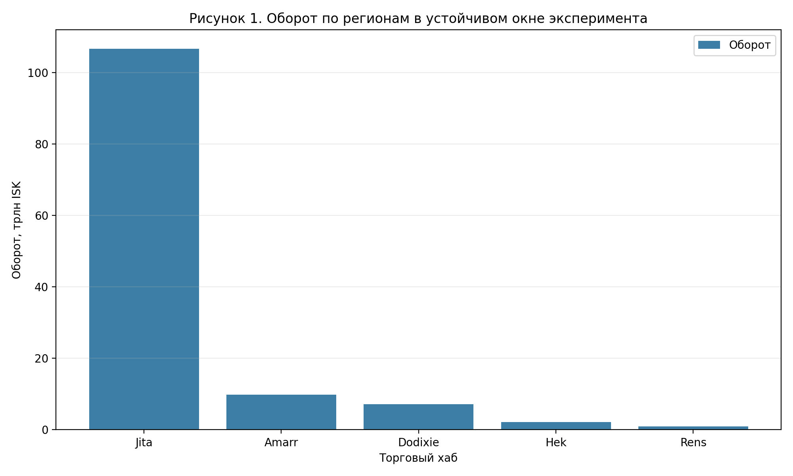
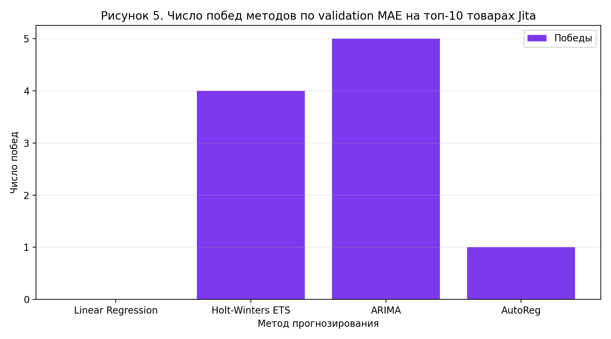
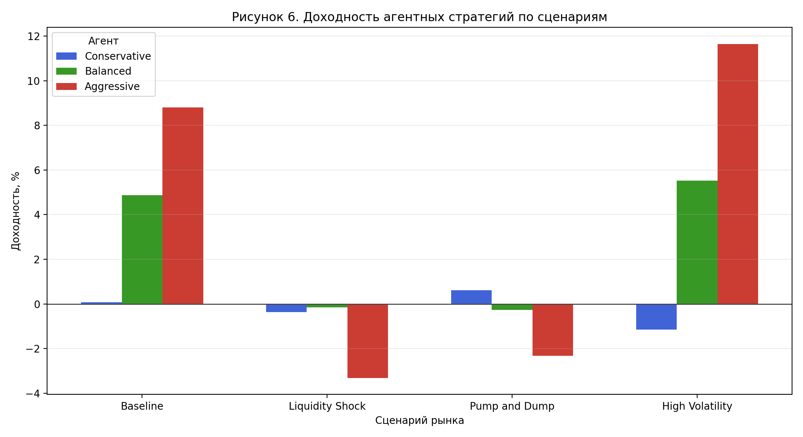
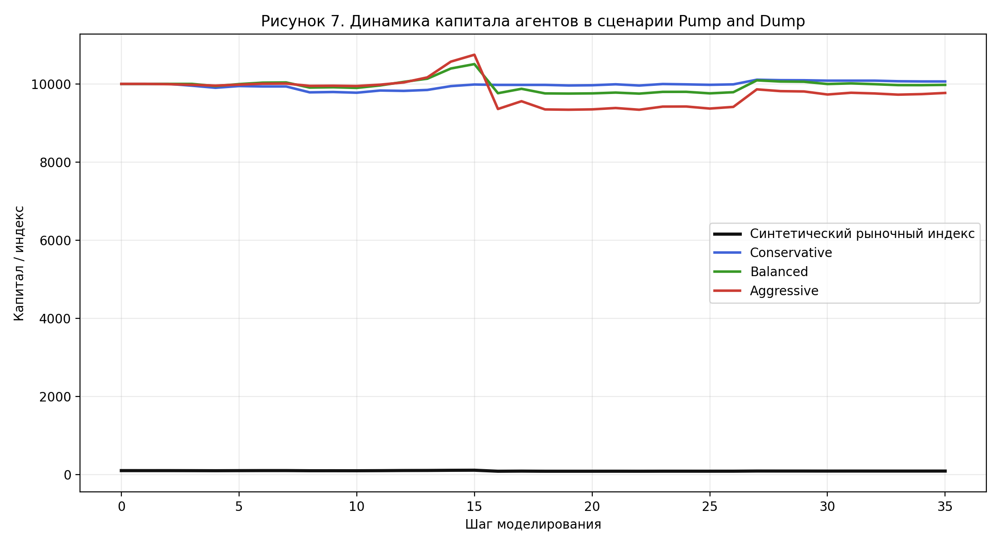

**РОССИЙСКИЙ УНИВЕРСИТЕТ ДРУЖБЫ НАРОДОВ ИМЕНИ ПАТРИСА ЛУМУМБЫ**  
**Факультет физико-математических и естественных наук**  
**Кафедра математического моделирования и искусственного интеллекта**

  
**УТВЕРЖДАЮ**  
Заведующий кафедрой математического моделирования и искусственного интеллекта  
`__________________` `[ФИО]`  
`«____» ____________ 2025 г.`

  
**НАУЧНО-ИССЛЕДОВАТЕЛЬСКАЯ РАБОТА**

  
**на тему**  
**«Разработка и реализация программного интерфейса для анализа внутриигровой экономики»**

  
Выполнил: `[ФИО]`  
Студент группы: `[Группа]`  
Студенческий билет №: `[Номер]`

  
Руководитель: `[ФИО научного руководителя]`

  
**Москва 2025**

\newpage

# Аннотация {-}

Работа посвящена разработке и реализации прототипа программного интерфейса `FluxEVEngine`, предназначенного для анализа внутриигровой экономики `EVE Online`. Актуальность исследования определяется тем, что виртуальные рынки современных многопользовательских игр обладают признаками реальных экономических систем: неравномерностью распределения ликвидности, колебаниями цен, реакцией на локальные шоки и устойчивыми торговыми центрами. При этом для практического анализа таких рынков требуются не только средства визуализации, но и единая программная среда, объединяющая сбор данных, хранение истории, аналитическую обработку и прогнозирование.

В работе реализована система, использующая официальный `ESI API`, асинхронный backend на `FastAPI`, хранилище `PostgreSQL`, модуль вычисления торговых метрик и web-интерфейс на `Next.js` с визуализацией на базе `Plotly.js`. На реальных данных рынка `EVE Online` проведён вычислительный эксперимент для сравнения методов прогнозирования `Linear Regression`, `Holt-Winters ETS`, `ARIMA` и `AutoReg`. На момент проведения эксперимента база содержала `125034` строк рыночной истории по `1000` товарам и `5` торговым регионам. Для устойчивого окна наблюдений `2026-03-16`–`2026-04-20` получено, что регион `Jita` концентрирует `84,21%` суммарного оборота выборки. По пяти базовым сценариям лучший метод превосходит линейный бейзлайн в среднем на `40,14%` по метрике `validation MAE`.

Дополнительно в исследовательский контур прототипа включён агентно-ориентированный сценарный блок, позволяющий оценивать устойчивость торговых стратегий при нормальном рынке, шоке ликвидности, сценарии `Pump and Dump` и повышенной волатильности. Практическая значимость работы состоит в создании воспроизводимого программного комплекса для мониторинга, анализа и краткосрочного прогнозирования рыночной динамики внутриигровой экономики.

\newpage

# Abstract {-}

This research focuses on the development and implementation of `FluxEVEngine`, a prototype software interface for analyzing the in-game economy of `EVE Online`. The relevance of the study is determined by the fact that virtual markets in large-scale online games exhibit many properties of real economic systems, including liquidity concentration, price dispersion, short-term shocks, and persistent trading hubs. Therefore, practical analysis requires not only visualization tools but also an integrated software environment combining data collection, storage, analytics, and forecasting.

The implemented prototype uses the official `ESI API`, an asynchronous `FastAPI` backend, a `PostgreSQL` database, an analytical layer for turnover and price dynamics, and a `Next.js` frontend with `Plotly.js` visualizations. A computational experiment was conducted on real `EVE Online` market data to compare four forecasting methods: `Linear Regression`, `Holt-Winters ETS`, `ARIMA`, and `AutoReg`. At the time of the experiment, the database contained `125034` historical records covering `1000` tracked items and `5` trade regions. For the stable observation window `2026-03-16` to `2026-04-20`, the `Jita` hub accounted for `84.21%` of the total turnover. Across five core scenarios, the best model outperformed the linear baseline by an average of `40.14%` in terms of `validation MAE`.

An experimental agent-oriented scenario layer was also included in the prototype to study the behavior of trading strategies under normal conditions, liquidity shock, `Pump and Dump`, and high-volatility regimes. The practical contribution of the work lies in the creation of a reproducible software complex for monitoring, analyzing, and short-horizon forecasting of virtual market dynamics.

\newpage

# Ключевые слова {-}

Виртуальная экономика, EVE Online, анализ рынка, временные ряды, прогнозирование цен, FastAPI, PostgreSQL.

\newpage

# Keywords {-}

Virtual economy, EVE Online, market analysis, time series, price forecasting, FastAPI, PostgreSQL.

\newpage

# Введение

В последние годы внутриигровые экономики крупных многопользовательских проектов перестали быть исключительно игровым механизмом и стали рассматриваться как самостоятельный объект анализа. Особенно показательна в этом отношении экономика `EVE Online`, в которой торговля товарами осуществляется на региональных рынках, а поведение игроков формирует сложную систему ценовых зависимостей, локальных дефицитов, концентрации ликвидности и спекулятивных эффектов. Для исследователя такая среда представляет интерес как модель квазиреального рынка, где можно наблюдать проявления тренда, краткосрочной волатильности, дисбаланса спроса и предложения, а также различий между торговыми хабами.

Актуальность работы обусловлена тремя обстоятельствами. Во-первых, официальные данные `EVE Online` доступны через публичный программный интерфейс, однако сами по себе они не образуют удобной аналитической среды. Во-вторых, существующие рыночные сервисы, как правило, ориентированы либо на просмотр текущих цен, либо на прикладные торговые расчёты, но не предоставляют единого исследовательского контура, объединяющего сбор истории, хранение, визуализацию и сравнение прогнозных методов. В-третьих, интерес представляет сопоставление классических методов прогнозирования временных рядов на данных виртуальной экономики и оценка того, насколько хорошо они переносятся в прикладной игровой контекст.

Объектом исследования является виртуальная экономика `EVE Online` как совокупность рыночных процессов, происходящих на торговых площадках игры. Предметом исследования выступают методы программного анализа исторических рыночных данных, средства их визуализации и алгоритмы краткосрочного прогнозирования цен на внутриигровые товары.

Цель работы состоит в разработке прототипа системы анализа и прогнозирования рыночных данных виртуальной экономики `EVE Online`, а также в сравнительном анализе интегрированных методов прогнозирования, применяемых в реальных экономических задачах, для оценки их применимости к внутриигровому рынку.

Для достижения поставленной цели в работе решаются следующие задачи:

1. Исследовать особенности виртуальной экономики `EVE Online` как объекта анализа рыночных процессов.
2. Провести анализ методов прогнозирования, применяемых в реальных экономических задачах и пригодных для работы с торговыми временными рядами.
3. Спроектировать структуру системы сбора, хранения, обработки и визуализации исторических рыночных данных.
4. Реализовать прототип системы анализа торговых показателей по товарам, регионам, ценам и обороту.
5. Интегрировать в систему несколько методов прогнозирования и выполнить их сравнительный анализ на данных виртуального рынка.
6. Реализовать исследовательский сценарный контур агентного моделирования торгового поведения с агентами, различающимися по уровню риска и характеру реакции на рыночные возмущения.
7. Провести сравнительное сценарное моделирование и оценить устойчивость стратегий в различных рыночных режимах, включая повышенную волатильность, шок ликвидности и манипулятивные сценарии.

Научно-практический результат работы заключается в создании воспроизводимого программного комплекса, который позволяет перейти от фрагментарного просмотра игровых цен к систематическому анализу рынка, вычислению торговых метрик, сравнению моделей прогнозирования и исследованию устойчивости торговых стратегий в специально заданных сценариях.

\newpage

# Обзор аналогов и существующих решений

### 2.1. Особенности виртуальной экономики EVE Online

Экономика `EVE Online` является одной из наиболее известных виртуальных экономик с высокой степенью вовлечённости игроков в производство, логистику, торговлю и спекулятивные операции. Существенная часть ценовой динамики формируется не скриптами, а действиями самих участников рынка, что делает внутриигровые временные ряды содержательно близкими к данным реальных товарных площадок. Вместе с тем виртуальная среда вносит ряд особенностей: высокую чувствительность к игровым обновлениям, событийным аномалиям, активности отдельных корпораций и изменению внутриигровых маршрутов поставки.

Для анализа такой экономики важны несколько факторов. Во-первых, рынок распределён по регионам, поэтому даже для одного и того же товара могут наблюдаться различия в цене и ликвидности между `Jita`, `Amarr`, `Dodixie`, `Hek` и `Rens`. Во-вторых, динамика ряда может зависеть не только от долгосрочного тренда, но и от краткосрочных всплесков спроса, дефицита ресурса или манипулятивных действий игроков. В-третьих, исторические ряды по отдельным товарам сильно различаются по масштабу цен, амплитуде колебаний и частоте структурных переломов, что делает задачу выбора прогностической модели нетривиальной.

### 2.2. Анализ существующих решений

Существующие инструменты, связанные с рынком `EVE Online`, можно разделить на три группы.

К первой группе относятся официальные средства доступа к данным. Основным источником рыночной информации является `EVE Swagger Interface (ESI)`, предоставляющий REST-доступ к истории рынка, ордерам и информации о типах объектов. Данный интерфейс необходим для получения первичных данных, однако он не решает задачи хранения истории, сводной аналитики и пользовательской визуализации.

Ко второй группе относятся прикладные внешние сервисы для трейдеров и промышленников. Например, `EVE Tycoon` ориентирован на контроль прибыли, управление ордерами и оценку производственных цепочек. Аналогично `EVE Appraisal` и связанные с ним инструменты сосредоточены на оценке стоимости наборов предметов, мониторинге цен и вспомогательных торговых расчётах. Современные market-intelligence сервисы наподобие `7o.market` делают акцент на оперативной рыночной разведке, включая наблюдение за ордерами и сигналы по ценам. Эти системы полезны в практической торговле, однако обычно не формируют полный исследовательский контур с локальным хранилищем истории, собственной аналитической моделью и воспроизводимым сравнением прогнозных методов.

К третьей группе относятся универсальные аналитические инструменты и библиотеки временных рядов. Они предоставляют мощные алгоритмические возможности, но требуют самостоятельного построения предметно-ориентированной инфраструктуры: организации ETL-процесса, хранения истории, выбора рыночных объектов, разработки прикладного API и пользовательского интерфейса.

С точки зрения задач данной работы ключевым ограничением существующих решений является отсутствие целостного программного интерфейса, ориентированного именно на исследование внутриигровой экономики `EVE Online`. Либо данные доступны в сыром виде, либо интерфейс заточен под прикладные действия игрока, но не под систематический анализ, воспроизводимый эксперимент и сравнение методов прогнозирования.

### 2.3. Обоснование выбора подхода

С учётом рассмотренных ограничений в работе выбран подход, предполагающий создание собственного программного интерфейса `FluxEVEngine`, который объединяет следующие свойства:

1. Автоматизированный сбор и накопление исторических данных из официального API.
2. Единое реляционное хранилище для рыночной истории и справочника отслеживаемых товаров.
3. Прикладной REST API для аналитических и прогнозных запросов.
4. Визуальный dashboard для анализа регионального оборота, структуры рынка, динамики цен и прогнозов.
5. Подсистему сравнения нескольких методов прогнозирования на одном и том же временном ряду.
6. Исследовательский сценарный контур агентного моделирования, использующий реальные рыночные ряды как основу для генерации рыночных режимов.

Такой подход отличается от готовых рыночных сервисов тем, что ставит в центр не только удобство просмотра данных, но и воспроизводимость вычислительного эксперимента.

\newpage

# Описание разработки

### 3.1. Общая архитектура системы

Разработанный прототип `FluxEVEngine` построен по модульному принципу. Архитектура системы включает слой получения данных, слой хранения, аналитико-прогнозный слой, API-слой и web-интерфейс. На старте приложения инициализируется общий HTTP-клиент для `ESI`, а также фоновый планировщик, отвечающий за периодическое обновление рыночной истории. Полученные данные сохраняются в `PostgreSQL` и далее используются как источники для аналитических запросов и прогностических расчётов.

Функционально система разделяется на следующие компоненты:

1. Модуль интеграции с `ESI API`, отвечающий за загрузку рыночной истории и списков торгуемых объектов.
2. База данных `PostgreSQL`, хранящая историю цен, объёмов и ордеров.
3. Backend на `FastAPI`, предоставляющий REST API для истории цен, прогнозов и dashboard-данных.
4. Модуль прогнозирования, реализующий несколько методов временных рядов и механизм сравнительного выбора модели.
5. Frontend на `Next.js` и `React`, визуализирующий результаты в виде графиков и диаграмм.
6. Исследовательский агентно-ориентированный контур, использующий исторические данные как основу для моделирования поведения стратегий в различных рыночных сценариях.

Такое разделение позволяет независимо развивать подсистемы сбора данных, вычислений, пользовательского интерфейса и сценарного моделирования.

### 3.2. Технологический стек

Выбор инструментов был подчинён двум требованиям: простоте интеграции и пригодности для обработки временных рядов. В качестве базового языка выбран `Python 3.12`, поскольку он предоставляет удобную экосистему для web-разработки, аналитики и научных вычислений. Для server-side логики выбран `FastAPI`, сочетающий высокую производительность, асинхронную модель работы и автоматическую генерацию OpenAPI-документации. Для хранения данных используется `PostgreSQL 17`, а взаимодействие с БД реализовано через `SQLAlchemy async` и драйвер `asyncpg`. Миграции схемы поддерживаются `Alembic`.

Для получения данных из `ESI` применяется `aiohttp`, что позволяет выполнять сетевые запросы в асинхронном режиме. Периодическое обновление истории выполняется с помощью `APScheduler`. Вычислительный и прогнозный слой опирается на `NumPy` и библиотеку `statsmodels`, в которой реализованы применяемые методы временных рядов. На frontend используется `Next.js`, `React` и `Plotly.js`, обеспечивающие интерактивную визуализацию рынка и прогнозов. Поддержка воспроизводимости обеспечивается миграциями БД и workflow-пайплайнами в `GitHub Actions`.

**Таблица 1. Технологический стек проекта**

| Слой системы | Технологии | Назначение |
| --- | --- | --- |
| Серверная логика | Python 3.12, FastAPI, Uvicorn | Реализация REST API и оркестрация сервисов |
| Хранение данных | PostgreSQL 17, SQLAlchemy async, asyncpg, Alembic | Хранение истории рынка, ORM и миграции схемы |
| Сбор данных | aiohttp, ESI API, APScheduler | Асинхронная загрузка и ежедневное обновление рыночной истории |
| Аналитика и прогноз | NumPy, statsmodels | Расчёт метрик, регрессии и временных моделей |
| Визуализация | Next.js, React, Plotly.js | Dashboard, графики и интерактивное сравнение моделей |
| Автоматизация | GitHub Actions, Bun | CI/CD, сборка frontend и выпуск архивов релиза |

### 3.3. Модель данных

Модель данных проекта реализована в виде трёх основных сущностей.

Сущность `TrackedItem` хранит перечень отслеживаемых товаров. Для каждого объекта фиксируются внутренний идентификатор, `type_id`, название и дата добавления в систему.

Сущность `MarketHistory` является центральной таблицей проекта. В ней содержатся `type_id`, `region_id`, дата наблюдения, средняя цена (`average`), максимальная и минимальная цена (`highest`, `lowest`), объём торгов (`volume`) и количество ордеров (`order_count`). Эта таблица используется как основа для вычисления оборота, построения временных рядов и последующего прогнозирования.

Сущность `MarketOrder` предназначена для хранения информации по рыночным ордерам: цене, остатку объёма, признаку buy/sell-ордера, месту размещения и времени фиксации. Хотя в текущем исследовательском контуре основной акцент сделан на анализе исторических рядов `market_history`, наличие таблицы ордеров создаёт основу для дальнейшего расширения аналитики в направлении microstructure-анализа и агентных сценариев.

### 3.4. Ключевые проектные решения

В ходе разработки были приняты несколько принципиальных решений.

Во-первых, в качестве опорных торговых площадок выбраны пять крупнейших хабов: `Jita`, `Amarr`, `Dodixie`, `Hek` и `Rens`. Это обеспечивает хорошее покрытие рынка без избыточного усложнения инфраструктуры.

Во-вторых, в системе используется список из `1000` отслеживаемых товаров, формируемый по торговой активности. Такое ограничение делает сбор данных достаточно широким, но при этом сохраняет разумную вычислительную стоимость обновлений.

В-третьих, архитектура прогностического слоя построена так, чтобы разные методы работали на одном и том же временном ряду и оценивались по одинаковой процедуре валидации. Это превращает модуль прогнозирования из набора разрозненных алгоритмов в средство строгого сравнительного анализа.

В-четвёртых, в качестве дополнительного исследовательского расширения в прототип включён сценарный агентный контур. Он не подменяет основной модуль прогнозирования, а дополняет его возможностью анализировать поведение стратегий при изменении структуры рынка.

\newpage

# Реализация

### 4.1. Реализация сбора и обновления данных

Получение рыночной информации реализовано через официальный `ESI API`. Отдельный модуль интеграции содержит асинхронный клиент и функции доступа к истории рынка, ордерам и региональным данным. На старте приложения создаётся общий HTTP-клиент, который затем используется всеми модулями, выполняющими загрузку данных.

Для ежедневного обновления истории используется `APScheduler`. В текущей конфигурации фоновая задача запускается ежедневно в `01:00` и проходит по всем отслеживаемым товарам и выбранным регионам. Для каждой пары `товар-регион` из `ESI` извлекается последняя доступная запись истории, после чего система проверяет, существует ли уже такая строка в `market_history`. Если запись отсутствует, она добавляется в базу. Такой подход исключает дублирование и делает ежедневный сбор инкрементальным.

Дополнительно в проекте присутствуют служебные скрипты для первичного заполнения справочника товаров, пакетной загрузки истории, анализа цен и диагностики состояния базы. Это важно для воспроизводимости эксперимента и удобства сопровождения прототипа.

### 4.2. Реализация backend и API

Серверная часть проекта реализована на `FastAPI`. Приложение включает два основных маршрутизатора: один для рыночных и прогностических API, другой для агрегированных dashboard-данных. Такой подход разделяет детальные аналитические запросы и высокоуровневую визуальную сводку.

В API реализованы следующие ключевые возможности:

1. Получение списка отслеживаемых товаров.
2. Запрос исторического ряда цен по товару и региону.
3. Получение линейного прогноза и метрик качества.
4. Получение списка доступных методов прогнозирования.
5. Сравнение нескольких прогностических методов на одном и том же ряду.
6. Получение dashboard-данных по обороту регионов и структуре товарного рынка.

Для агрегированных расчётов backend вычисляет оборот как произведение `volume * average`, поддерживает агрегацию по регионам и товарам, а также дополнительно оценивает эквивалент стоимости в `USD` через актуальную цену `PLEX` на рынке `Jita`.

### 4.3. Реализация прогностической подсистемы

Ключевым функциональным блоком проекта является подсистема прогнозирования. В её составе реализованы четыре метода:

1. `Linear Regression` как интерпретируемый бейзлайн.
2. `Holt-Winters ETS` как модель экспоненциального сглаживания с учётом уровня и тренда.
3. `ARIMA` как классическая авторегрессионно-интегрированная модель скользящего среднего.
4. `AutoReg` как авторегрессионная модель по лагам ряда.

Архитектура прогностического слоя унифицирована: для каждого метода задаются минимальные требования к длине обучающей выборки, общий интерфейс формирования прогноза и единая процедура расчёта метрик. Возвращаемый результат включает исторические даты и значения, прогнозные даты и значения, число точек обучения, признак фиксированной цены, коэффициент наклона, `R2` и словарь метрик.

Принципиально важно, что сравнение моделей строится не на субъективной визуальной оценке, а на контролируемой валидации по отложенному фрагменту ряда. В качестве основного критерия выбора лучшей модели система использует `validation MAE`.

### 4.4. Реализация пользовательского интерфейса

Пользовательский интерфейс проекта реализован на `Next.js` и `React`. Dashboard состоит из нескольких аналитических секций:

1. Диаграмма торгового оборота по регионам.
2. Структура оборота по товарам в выбранном хабе или по всем пяти хабам.
3. График исторической цены товара.
4. График прогноза и сравнения прогностических моделей.

Для визуализации используется `Plotly.js`, что позволяет строить интерактивные графики с легендой, подписями осей и гибкой настройкой пользовательского представления. Интерфейс ориентирован не только на демонстрацию итоговых чисел, но и на аналитическую работу с временным рядом.

### 4.5. Автоматизация и воспроизводимость

В репозитории проекта реализованы автоматизированные workflow-пайплайны `GitHub Actions`. Непрерывная интеграция включает запуск `PostgreSQL` в CI-окружении, установку зависимостей, применение миграций `Alembic`, проверку схемы БД, компиляционную проверку Python-источников и smoke-test импорта `FastAPI`-приложения. Это повышает надёжность прототипа и снижает риск скрытых регрессионных ошибок.

Отдельный workflow отвечает за выпуск релизного архива по git-тегу. Таким образом, проект уже на уровне прототипа обладает элементами инженерной зрелости, важными для воспроизводимости результатов и последующего развития.

### 4.6. Реализация исследовательского агентного контура

Помимо базовой аналитики и прогнозирования, в рамках исследовательского развития `FluxEVEngine` в работу включён сценарный агентно-ориентированный контур. Его задача состоит не в подмене классических прогностических моделей, а в имитации торгового поведения агентов, различающихся по уровню риска и способу реакции на рыночные сигналы.

Для построения экспериментальной среды использован синтетический рыночный индекс, сформированный на основе нормализованных цен наиболее ликвидных базовых ресурсов `Jita`: `Tritanium`, `Pyerite`, `Mexallon`, `Isogen` и `Nocxium`. На этой основе задаются четыре сценария:

1. `Baseline` – рынок без дополнительного шокового возмущения.
2. `Liquidity Shock` – локальное ухудшение ликвидности и отрицательный ценовой удар.
3. `Pump and Dump` – сценарий искусственного разгона с последующим резким обрушением.
4. `High Volatility` – режим повышенной амплитуды колебаний.

В сценарном контуре рассматриваются три типа агентов:

1. `Conservative` – умеренное участие в рынке с жёстким контролем риска.
2. `Balanced` – смешанная стратегия, сочетающая следование тренду и ограниченное участие на просадках.
3. `Aggressive` – стратегия активного входа в рынок при наличии импульса.

Подобная постановка не претендует на исчерпывающее моделирование всех торговых практик игроков, однако уже на уровне прототипа позволяет анализировать устойчивость разных режимов поведения в зависимости от рыночного сценария. Это создаёт естественный мост между модулем прогнозирования и перспективным развитием агентного моделирования.

\newpage

# Результаты тестирования и апробации

### 5.1. Исходные данные и параметры эксперимента

Вычислительный эксперимент проводился на реальных данных, собранных прототипом `FluxEVEngine` в `PostgreSQL`. На момент расчётов в хранилище содержалось `125034` строк рыночной истории по `1000` товарам и `5` торговым регионам. Для чистоты сравнения методов использовалось устойчивое окно плотных ежедневных наблюдений `2026-03-16`–`2026-04-20`. День `2026-04-21` не включался в основную выборку, поскольку был заполнен в БД лишь частично.

**Таблица 2. Общие характеристики экспериментального набора данных**

| Metric | Value |
| --- | --- |
| Tracked items | 1000 |
| Market history rows | 125034 |
| Distinct item types | 1000 |
| Distinct regions | 5 |
| Date from | 2025-02-01 |
| Date to | 2026-04-21 |
| Stable experiment window | 2026-03-16..2026-04-20 |
| Rows in stable window | 123107 |
| Forecast horizon (days) | 7 |
| Validation window (days) | 7 |

Для сравнительного анализа прогностических моделей был выбран регион `Jita` как наиболее ликвидный торговый хаб. В качестве базовых сценариев сравнения использованы пять товаров с полной историей в устойчивом окне: `Tritanium`, `Pyerite`, `Mexallon`, `Isogen`, `Nocxium`.

**Таблица 3. План вычислительного эксперимента по товарам Jita**

| Scenario | Region | Item | Period | Observations | Forecast_days | Validation_days | Methods | Min_price_ISK | Max_price_ISK |
| --- | --- | --- | --- | --- | --- | --- | --- | --- | --- |
| S1 | Jita | Tritanium | 2026-03-16..2026-04-20 | 36 | 7 | 7 | linear, holt_winters, arima, autoreg | 3.86 | 4.22 |
| S2 | Jita | Pyerite | 2026-03-16..2026-04-20 | 36 | 7 | 7 | linear, holt_winters, arima, autoreg | 16.41 | 19.1 |
| S3 | Jita | Mexallon | 2026-03-16..2026-04-20 | 36 | 7 | 7 | linear, holt_winters, arima, autoreg | 55.2 | 68.49 |
| S4 | Jita | Isogen | 2026-03-16..2026-04-20 | 36 | 7 | 7 | linear, holt_winters, arima, autoreg | 145.0 | 229.9 |
| S5 | Jita | Nocxium | 2026-03-16..2026-04-20 | 36 | 7 | 7 | linear, holt_winters, arima, autoreg | 776.1 | 944.4 |

### 5.2. Анализ структуры рынка и торгового оборота

Первый уровень апробации связан с анализом агрегированных рыночных показателей. Для окна `2026-03-16`–`2026-04-20` рассчитан суммарный оборот по основным торговым регионам.

**Таблица 4. Оборот по регионам в устойчивом окне наблюдений**

| Region | Rows | Turnover_ISK | Turnover_TISK | Share_pct |
| --- | --- | --- | --- | --- |
| Jita | 34586 | 106667502025945.31 | 106.668 | 84.2101 |
| Amarr | 26925 | 9765541582516.62 | 9.766 | 7.7095 |
| Dodixie | 24446 | 7152319672029.26 | 7.152 | 5.6465 |
| Hek | 19433 | 2117029183630.44 | 2.117 | 1.6713 |
| Rens | 17717 | 965881634082.59 | 0.966 | 0.7625 |

Полученные данные показывают выраженную концентрацию ликвидности в `Jita`: на этот хаб приходится `84,21%` оборота рассматриваемой выборки. Такой результат соответствует экспертному представлению о `Jita` как о доминирующем торговом центре `EVE Online` и одновременно объясняет выбор этого региона в качестве основной площадки для прогностического эксперимента.

{ width=92% }

На рисунке 1 видно, что остальные хабы выполняют скорее вспомогательную роль. `Amarr` и `Dodixie` формируют заметные, но существенно меньшие по объёму рынки, тогда как `Hek` и `Rens` уступают по обороту на порядок и более.

{ width=92% }

Внутренняя структура оборота `Jita` также оказывается неравномерной. Наибольший вклад в рассматриваемом окне внесли `HyperCore`, `Logic Circuit`, `Triglavian Survey Database`, `Drone Iteration Data` и `Isogen`. Наличие в лидирующей группе как промышленных материалов, так и высокооборотных специализированных товаров подчёркивает неоднородность внутриигрового рынка.

### 5.3. Сравнение методов прогнозирования

Основной блок апробации связан с Треком П и ориентирован на сравнение бейзлайна с конкурирующими подходами. В качестве базовой модели использовалась `Linear Regression`, а в роли альтернативных методов – `Holt-Winters ETS`, `ARIMA` и `AutoReg`.

**Таблица 5. Сравнение прогностических моделей по validation-метрикам**

| Item | Method | Validation_MAE | Validation_RMSE | Validation_MAPE_pct | R2 | Best_for_item |
| --- | --- | --- | --- | --- | --- | --- |
| Tritanium | Linear Regression | 0.045729 | 0.050433 | 1.103148 | 0.739098 | yes |
| Tritanium | Holt-Winters ETS | 0.105214 | 0.119559 | 2.546277 | 0.809093 | no |
| Tritanium | ARIMA | 0.053086 | 0.074924 | 1.293522 | 0.764278 | no |
| Tritanium | AutoReg | 0.126186 | 0.137389 | 3.047109 | 0.831631 | no |
| Pyerite | Linear Regression | 0.260157 | 0.279972 | 1.391693 | 0.718607 | no |
| Pyerite | Holt-Winters ETS | 0.261329 | 0.303166 | 1.3932 | 0.780324 | no |
| Pyerite | ARIMA | 0.113486 | 0.137369 | 0.604918 | -27.370504 | yes |
| Pyerite | AutoReg | 0.128014 | 0.150847 | 0.682376 | 0.678659 | no |
| Mexallon | Linear Regression | 2.529557 | 2.692396 | 3.744592 | 0.44293 | no |
| Mexallon | Holt-Winters ETS | 3.015 | 3.406479 | 4.495881 | 0.843716 | no |
| Mexallon | ARIMA | 1.1237 | 1.331032 | 1.664587 | -8.438402 | yes |
| Mexallon | AutoReg | 3.234543 | 3.692172 | 4.826233 | 0.861477 | no |
| Isogen | Linear Regression | 19.349486 | 19.860419 | 8.775212 | 0.586192 | no |
| Isogen | Holt-Winters ETS | 6.931971 | 7.400565 | 3.143771 | 0.816625 | yes |
| Isogen | ARIMA | 8.339871 | 9.117004 | 3.786034 | -1.17689 | no |
| Isogen | AutoReg | 25.899557 | 27.797101 | 11.720191 | 0.861581 | no |
| Nocxium | Linear Regression | 49.9465 | 54.525386 | 6.096428 | 0.003861 | no |
| Nocxium | Holt-Winters ETS | 37.669871 | 42.95043 | 4.610551 | 0.764841 | yes |
| Nocxium | ARIMA | 47.017886 | 52.359961 | 5.746342 | -15.212229 | no |
| Nocxium | AutoReg | 41.6496 | 47.052782 | 5.094692 | 0.679104 | no |

Сравнение показывает, что универсального лидера среди методов нет, однако линейный бейзлайн уступает более сложным моделям в большинстве сценариев. Для `Tritanium` лучшим остаётся `Linear Regression`, что логично для ряда с относительно устойчивым трендом и небольшим диапазоном значений. Однако уже для `Pyerite` и `Mexallon` минимальный `validation MAE` показывает `ARIMA`, а для `Isogen` и `Nocxium` лучшим методом оказывается `Holt-Winters ETS`.

Средний выигрыш лучшего метода относительно линейного бейзлайна по пяти базовым сценариям составил `40,14%` по `validation MAE`. Это позволяет сделать вывод, что интеграция нескольких моделей в аналитическую систему оправдана и практически полезна.

{ width=92% }

На рисунке 3 видно, что различные модели по-разному продолжают ряд `Isogen`. Линейный бейзлайн задаёт простое трендовое продолжение, тогда как `Holt-Winters` и `ARIMA` лучше адаптируются к локальной структуре движения, что и отражается в меньшей ошибке на тестовом отрезке.

Для проверки устойчивости вывода было проведено дополнительное сравнение на расширенной выборке из `10` наиболее ликвидных товаров `Jita`.

**Таблица 6. Частота побед методов на топ-10 ликвидных товарах Jita**

| Method | Win_count | Share_pct |
| --- | --- | --- |
| Linear Regression | 0 | 0.0 |
| Holt-Winters ETS | 4 | 40.0 |
| ARIMA | 5 | 50.0 |
| AutoReg | 1 | 10.0 |

{ width=92% }

Результат по расширенной выборке усиливает основной вывод. `ARIMA` побеждает в `50%` сценариев, `Holt-Winters ETS` – в `40%`, `AutoReg` – в `10%`, а `Linear Regression` не показывает лучшего результата ни в одном из десяти дополнительных случаев. Следовательно, бейзлайн полезен как отправная точка и интерпретируемая модель, но для прикладной аналитической системы его одного недостаточно.

Следует отдельно отметить, что значение `R2` не может использоваться как единственный критерий выбора модели. Для некоторых рядов модель `ARIMA` показывает менее привлекательную внутривыборочную картину, но выигрывает на тестовом участке по `validation MAE`. С прикладной точки зрения это важнее, поскольку система ориентирована на прогноз будущих значений, а не только на аппроксимацию уже наблюдавшейся истории.

### 5.4. Верификация на тестовых данных

Верификация прогностической подсистемы выполнена по схеме `temporal hold-out`. Для каждого ряда последние `7` наблюдений исключались из обучения и использовались как тестовое окно. Модель обучалась на предыдущем фрагменте ряда, строила прогноз длиной `7` дней, после чего рассчитанные значения сравнивались с фактическими ценами.

{ width=92% }

Такой способ проверки соответствует реальному сценарию использования аналитической системы, когда будущие данные заранее неизвестны. Именно поэтому в работе основной акцент сделан на `validation MAE`, `validation RMSE` и `validation MAPE`. Проведённая верификация показывает, что подсистема прогнозирования реализована корректно и позволяет выбирать модель в зависимости от поведения конкретного временного ряда, а не по универсальному правилу.

### 5.5. Результаты агентного сценарного моделирования

Дополнительный уровень апробации связан с исследовательским агентным контуром. На базе синтетического рыночного индекса, построенного из исторических цен ликвидных ресурсов `Jita`, были сгенерированы четыре сценария: `Baseline`, `Liquidity Shock`, `Pump and Dump` и `High Volatility`. Далее оценивалась эффективность трёх агентных стратегий.

**Таблица 7. Результаты агентного моделирования по сценариям**

| Scenario | Agent | Final_capital | Return_pct | Max_drawdown_pct | Trades |
| --- | --- | --- | --- | --- | --- |
| Baseline | Conservative | 10006.54 | 0.07 | 2.26 | 11 |
| Baseline | Balanced | 10486.57 | 4.87 | 1.4 | 9 |
| Baseline | Aggressive | 10880.3 | 8.8 | 1.38 | 3 |
| Liquidity Shock | Conservative | 9962.62 | -0.37 | 2.26 | 11 |
| Liquidity Shock | Balanced | 9985.0 | -0.15 | 3.41 | 10 |
| Liquidity Shock | Aggressive | 9669.43 | -3.31 | 9.28 | 4 |
| Pump and Dump | Conservative | 10062.1 | 0.62 | 2.26 | 15 |
| Pump and Dump | Balanced | 9974.38 | -0.26 | 7.2 | 11 |
| Pump and Dump | Aggressive | 9768.27 | -2.32 | 13.1 | 5 |
| High Volatility | Conservative | 9885.76 | -1.14 | 4.3 | 13 |
| High Volatility | Balanced | 10552.24 | 5.52 | 2.68 | 10 |
| High Volatility | Aggressive | 11164.69 | 11.65 | 3.34 | 2 |

{ width=92% }

Полученные результаты показывают выраженную зависимость эффективности стратегии от рыночного режима. В базовом сценарии и при высокой волатильности максимальную доходность демонстрирует `Aggressive`-агент: `8,80%` и `11,65%` соответственно. Это означает, что в среде с выраженным импульсом агрессивное следование за движением цены может быть выгодным.

Однако при сценарии `Pump and Dump` поведение меняется: лучший итоговый результат показывает `Conservative`-агент с доходностью `0,62%` и низкой просадкой `2,26%`, тогда как агрессивная стратегия уходит в отрицательную доходность `-2,32%` при просадке `13,1%`. Иными словами, модель подтверждает интуитивный вывод о том, что стратегия, хорошо работающая на трендовом рынке, оказывается уязвимой к манипулятивному разогреву с последующим обвалом.

При `Liquidity Shock` лучшую итоговую доходность показывает `Balanced`-агент (`-0,15%`), тогда как `Conservative` ограничивает просадку меньшим значением риска, а `Aggressive` несёт наиболее заметные потери (`-3,31%`). Это позволяет трактовать сбалансированную стратегию как более устойчивую при умеренных структурных нарушениях ликвидности.

**Таблица 8. Лучшие агентные стратегии по рыночным сценариям**

| Scenario | Best_agent | Return_pct | Max_drawdown_pct |
| --- | --- | --- | --- |
| Baseline | Aggressive | 8.8 | 1.38 |
| Liquidity Shock | Balanced | -0.15 | 3.41 |
| Pump and Dump | Conservative | 0.62 | 2.26 |
| High Volatility | Aggressive | 11.65 | 3.34 |

{ width=92% }

На рисунке 7 видно, что в манипулятивном сценарии агрессивный агент дольше удерживает рыночную позицию и поэтому сильнее страдает от обрушения. Консервативная стратегия, напротив, выходит из позиции раньше и сохраняет капитал. Это делает агентный контур полезным как исследовательское дополнение к прогностическому блоку: прогноз отвечает на вопрос о вероятном краткосрочном движении цены, а сценарное моделирование – о том, как разные типы поведения переносят рыночные возмущения.

### 5.6. Итоговая интерпретация результатов

Совокупность полученных результатов подтверждает, что `FluxEVEngine` решает не только задачу визуального представления рыночных данных, но и задачу количественного анализа. На уровне агрегированной структуры рынка выявлена жёсткая концентрация оборота в `Jita`. На уровне временных рядов показано, что включение нескольких моделей прогнозирования существенно повышает аналитическую ценность системы по сравнению с использованием одной линейной регрессии. На уровне сценарного моделирования установлено, что эффективность торговой стратегии зависит не только от средней доходности, но и от характера рыночного режима и допустимого уровня риска.

Именно в этом состоит практическая значимость разработанного программного интерфейса: он позволяет не только наблюдать рынок, но и проводить воспроизводимые вычислительные эксперименты над ним.

\newpage

# Заключение

В рамках выполненной научно-исследовательской работы разработан и реализован прототип программного интерфейса `FluxEVEngine` для анализа внутриигровой экономики `EVE Online`. В ходе исследования обоснована актуальность анализа виртуальных рынков как объектов, обладающих признаками реальных экономических систем, и показано, что для их прикладного изучения требуется интегрированная программная среда, а не набор разрозненных сервисов.

В работе спроектирована архитектура системы, включающая сбор данных через официальный `ESI API`, хранение истории в `PostgreSQL`, аналитический и прогностический backend на `FastAPI`, а также frontend на `Next.js` и `Plotly.js`. Реализован модуль расчёта рыночных метрик, API для ценовой истории и dashboard-данных, а также подсистема сравнения нескольких методов прогнозирования временных рядов.

Экспериментальная апробация на реальных рыночных данных показала, что:

1. рынок рассматриваемой выборки жёстко концентрируется вокруг `Jita`, на которую приходится `84,21%` оборота;
2. использование нескольких прогнозных методов статистически и practically оправдано;
3. лучший метод превосходит линейный бейзлайн в среднем на `40,14%` по `validation MAE`;
4. при расширении выборки до `10` наиболее ликвидных товаров `Jita` конкурентные методы стабильно доминируют над `Linear Regression`;
5. сценарный агентный контур подтверждает зависимость эффективности стратегии от типа рыночного режима и даёт дополнительный аналитический слой поверх классического прогнозирования.

Практическая значимость работы заключается в том, что созданный прототип может использоваться как основа для систем мониторинга виртуальных рынков, для поддержки решений по внутриигровой торговле и для исследовательских работ, посвящённых сопоставлению игровых и реальных экономических процессов.

К направлениям дальнейшего развития относятся:

1. расширение охвата регионов и числа товаров;
2. подключение более сложных моделей прогнозирования и автоматизированного подбора гиперпараметров;
3. углубление анализа ордерного стакана и логистических факторов;
4. развитие пользовательского интерфейса в сторону более гибких сценариев отбора данных;
5. дальнейшая интеграция агентного моделирования в основной аналитический контур системы.

Таким образом, поставленная цель работы достигнута: реализован программный интерфейс для анализа внутриигровой экономики, а полученные результаты подтверждают перспективность совмещения средств визуализации, анализа временных рядов и сценарного моделирования в единой исследовательской среде.

\newpage

# Список литературы {-}

1. Lehdonvirta, V., Castronova, E. Virtual Economies: Design and Analysis. – Cambridge, MA: MIT Press, 2014.
2. Castronova, E. Synthetic Worlds: The Business and Culture of Online Games. – Chicago: University of Chicago Press, 2006.
3. Hyndman, R. J., Athanasopoulos, G. Forecasting: Principles and Practice. – 3rd ed. – Melbourne: OTexts, 2021. – URL: https://otexts.com/fpp3/ (дата обращения: 23.04.2026).
4. Brockwell, P. J., Davis, R. A. Introduction to Time Series and Forecasting. – 3rd ed. – Cham: Springer, 2016.
5. Hamilton, J. D. Time Series Analysis. – Princeton, NJ: Princeton University Press, 1994.
6. CCP Games. EVE Developer Documentation: EVE Swagger Interface (ESI). – URL: https://developers.eveonline.com/docs/services/esi/overview/ (дата обращения: 23.04.2026).
7. CCP Games. ESI Docs. – URL: https://docs.esi.evetech.net/docs/esi_introduction.html (дата обращения: 23.04.2026).
8. FastAPI. FastAPI Documentation. – URL: https://fastapi.tiangolo.com/ (дата обращения: 23.04.2026).
9. SQLAlchemy authors. SQLAlchemy 2.0 Documentation. Asynchronous I/O (asyncio). – URL: https://docs.sqlalchemy.org/20/orm/extensions/asyncio.html (дата обращения: 23.04.2026).
10. statsmodels developers. statsmodels Documentation: ARIMA, AutoReg, ExponentialSmoothing. – URL: https://www.statsmodels.org/stable/ (дата обращения: 23.04.2026).
11. PostgreSQL Global Development Group. PostgreSQL 17 Documentation. – URL: https://www.postgresql.org/docs/17/index.html (дата обращения: 23.04.2026).
12. Plotly Technologies Inc. Plotly JavaScript Open Source Graphing Library. – URL: https://plotly.com/javascript/ (дата обращения: 23.04.2026).
13. Next.js Team. Next.js Documentation. – URL: https://nextjs.org/docs (дата обращения: 23.04.2026).
14. NumPy Developers. NumPy Documentation. – URL: https://numpy.org/doc/stable/ (дата обращения: 23.04.2026).
15. EVE Tycoon. Profit tracking and market management application for EVE Online. – URL: https://evetycoon.com/ (дата обращения: 23.04.2026).
16. EVE Appraisal. EVE Online Market Tools: Appraisal & Market Watcher. – URL: https://eveappraisal.com/ (дата обращения: 23.04.2026).
